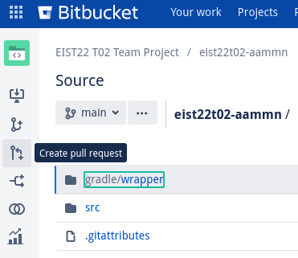
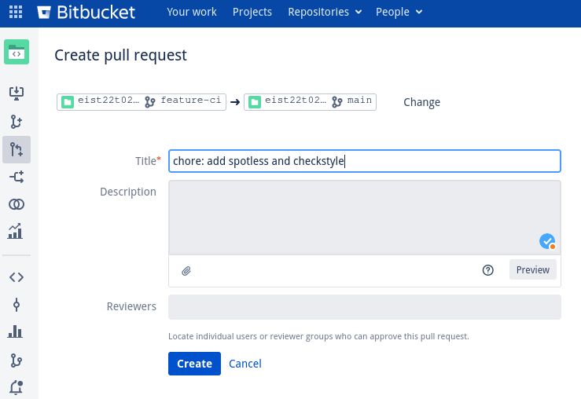
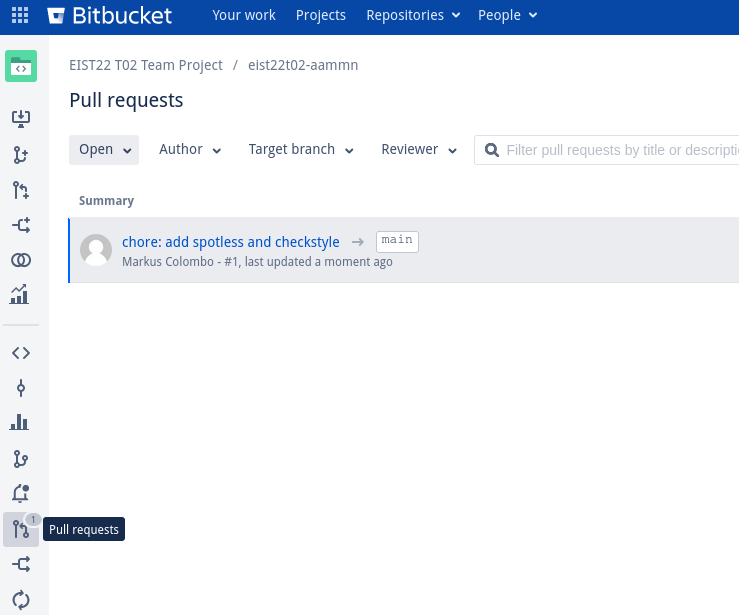
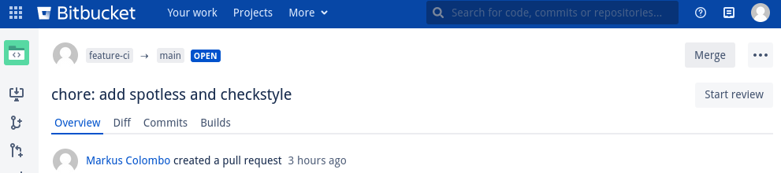

# AAMMN Reservation System

- [Repository][repo]
- [Problem Statement][problem]

The frontend source lives in [`./src/main/vue/`](./src/main/vue).

[problem]: https://bitbucket.ase.in.tum.de/projects/EIST22T02/repos/eist22t02-aammn/raw/docs/Problem_Statement_Reservation_System.pdf?at=refs%2Fheads%2Fmain
[repo]: https://bitbucket.ase.in.tum.de/projects/EIST22T02/repos/eist22t02-aammn/browse

## Build System
We use gradle as a build system.
To call gradle use `./gradlew` on UNIX systems
and `gradlew` on MS Windows.

- Run the app: `./gradlew run` ([App](http://localhost:8080))
- Run tests: `./gradlew test`
- Run tests and lints: `./gradlew check`
  - [Test Report][test-report]
  - [Checkstyle Report for Main][checkstyle-main]
  - [Checkstyle Report for Test][checkstyle-test]
  - Spotless' report is shown on stdout
- Run formatter: `./gradlew spotlessApply`
- Build Javadoc: `./gradlew javadoc` ([Resulting Javadoc][javadoc])
- Build self-contained JAR: `./gradlew bootJar` ([Resulting JAR](bootJar))

[javadoc]: ./build/docs/javadoc/index.html
[checkstyle-main]: ./build/reports/checkstyle/main.html
[checkstyle-test]: ./build/reports/checkstyle/test.html
[test-report]: ./build/reports/tests/test/index.html
[bootJar]: ./build/libs/AAMMN%20Reservation%20System-1.0.0.jar

## Version Control
We use git as a version control system.

You can pull changes made by others using `git pull`.

If you want to make changes to the code, create a new branch for that change.
Create the new one branching from `main` using `git checkout -b <branchname> main`.
It should start with `feature`, `fix`, `refactor`, or similar.
For example: `feature-searchbar` or `fix-offbyone`.

Make your changes, *run the tests* (see [build system above](#build-system)) and add them to git (for example using `git add -A`).
Think of a commit message which describes what the commit does
(for example `feature: add search bar`)
and commit the changes using `git commit -am '<message>'`.
Repeat this step as often as necessary, multiple smaller commits are often easier to reason about but too many can get
overwhelming.

You can periodically push your commits using `git push -u origin <branchname>` during this process.

On [BitBucket][repo] create a new pull request using the button in the sidebar
([or this link][create-pull]).

If you want someone else to look over your code you can tag them as a reviewer, for small changes this won't be necessary
in most cases unless it directly impacts something someone other is working on.

Bitbucket should automatically kick off tests and
you should be able to see the results under "Builds".
(This doesn't work yet)

You can see a list of all open pull requests by clicking the button in the sidebar
([or this link][list-pull]).

When the code is reviewed and ready for integration into the main branch click "Merge".

[create-pull]: https://bitbucket.ase.in.tum.de/projects/EIST22T02/repos/eist22t02-aammn/pull-requests?create=
[list-pull]: https://bitbucket.ase.in.tum.de/projects/EIST22T02/repos/eist22t02-aammn/pull-requests